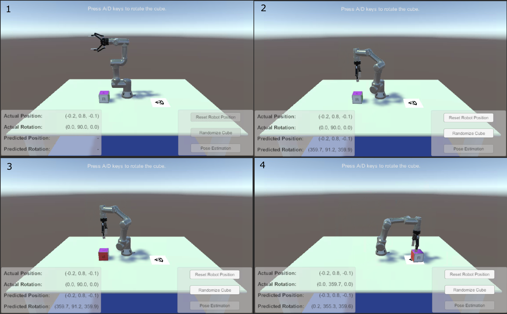
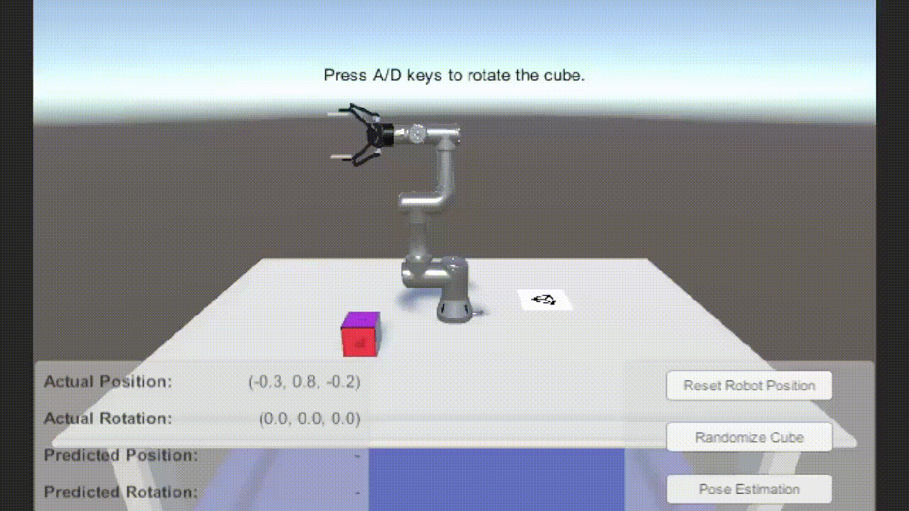

# Gesture-based-Feedback-in-Human-Robot-Interaction

    

## Gesture-based Feedback in Human-Robot Interaction for Object Manipulation

Human-Robot Interaction is a currently highly active research area with many advances in interfaces that allow humans and robots to have bi-directional feedback of their intentions. However, in an industrial setting, current robot feedback methods struggle to successfully deliver messages since the environment makes it difficult and inconvenient for the user to perceive them. This paper proposes a novel method for robot feedback, leveraging the **addition of social cues to robot movement** to notify the human of its intentions. Through the use of **robotic gestures**, we believe it is possible to successfully convey the robots’ goals in interactions with humans. To verify this hypothesis, a proof of concept was developed in a simulated environment using a robotic arm manipulator that notifies the user using gestures when it needs to correct the pose of an object.

[//]: # (colocar link do paper)

## Implementation

### Motion Planner Algorithm

Unity's [Object Pose Estimation Demo](https://github.com/Unity-Technologies/Robotics-Object-Pose-Estimation) was used as a reference for the implementation of the social cues. The tutorial was modified to fit our needs.

Firstly, an improvement to the overall motion planner was made by replacing the [RRTConnect](https://doi.org/10.1109/ROBOT.2000.844730) algorithm with the [RRT*](https://arxiv.org/abs/1105.1186) algorithm. This alteration improved the movements of the robot significantly. The animations below show examples of the robot's movements with the two motion planning algorithms (**Left: RRTConnect, Right: RRT\***).

    
    

### Circular Motion

The implemented proof of concept consists in restraining the pick-and-place action of the robot to a specific cube orientation. As such, incomming messages from Unity were checked for the orientation of the cube in the Y axis. If the cube is in the correct orientation the robot will place it in the goal position. Otherwise, the robot will notify the user with a circular gesture that the cube needs to be rotated. The user can interact with the cube to rotate it using the keyboard.

    

[//]: # (## Citation)

[//]: # (If you find this an interesting project and are interested in Human-Robot interactions please cite our paper:)
    
[//]: # (colocar bibtex do paper)

[//]: # (colocar citation do paper)